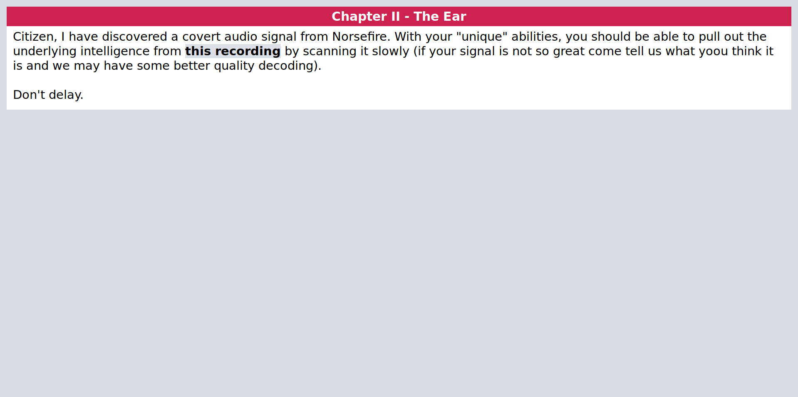
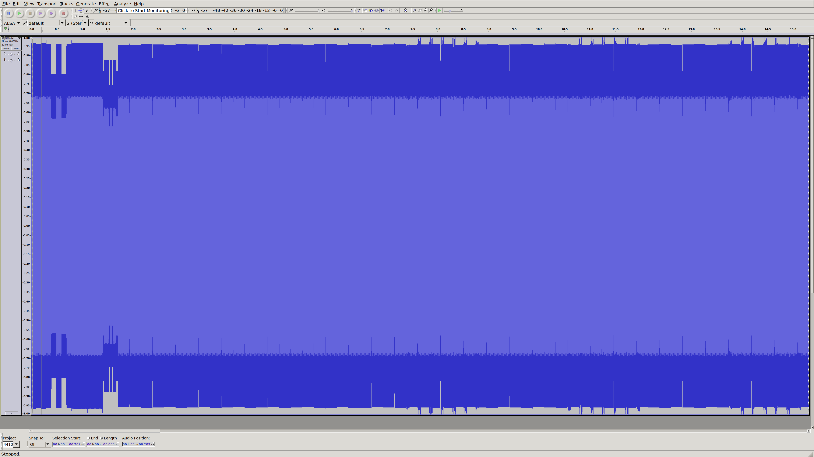
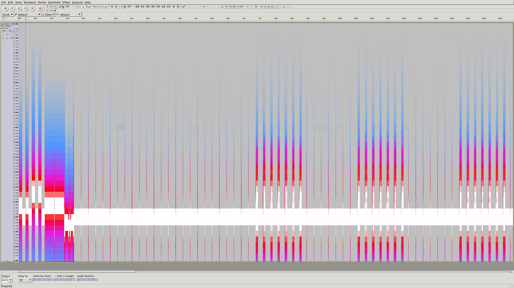
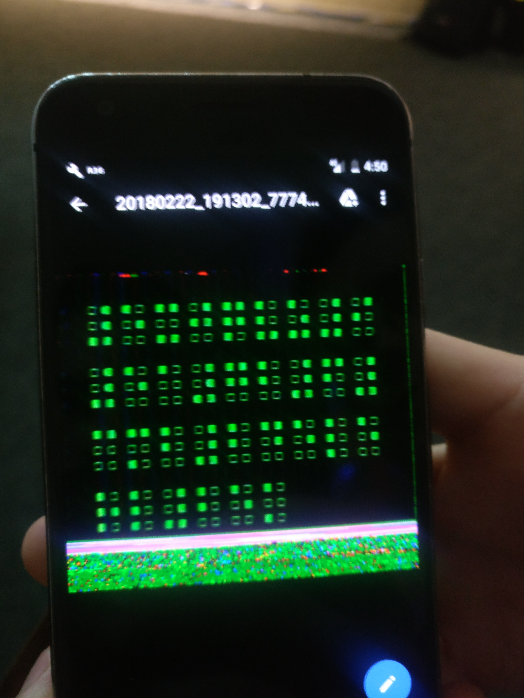

# Chapter II: The Ear



Awesome. Signals (particularly audio) puzzles are something actually within my realm of knowledge.

Here's the recording: [signal.wav](media/signal.wav).

So first up, let's check the file itself for any interesting metadata.

```
$ mediainfo signal.wav
General
Complete name                            : signal.wav
Format                                   : Wave
File size                                : 5.63 MiB
Duration                                 : 1 min 1 s
Overall bit rate mode                    : Constant
Overall bit rate                         : 768 kb/s
Audio
Format                                   : PCM
Format settings, Endianness              : Little
Format settings, Sign                    : Signed
Codec ID                                 : 1
Duration                                 : 1 min 1 s
Bit rate mode                            : Constant
Bit rate                                 : 768 kb/s
Channel(s)                               : 1 channel
Sampling rate                            : 48.0 kHz
Bit depth                                : 16 bits
Stream size                              : 5.63 MiB (100%)
```

Nothing special. So everything we're looking for must be in the signal itself.

For an attempted quick win, I ran it through [minimodem](http://www.whence.com/minimodem/) with all the common bauds and protocols. No dice though.

There was a lot of text in that Prologue flag page though. I went back and had a read for any possible clues on encoding. Of interest was this paragraph:

> If you are not listening carefully, you will miss things. Important things. I will not pause, I will not repeat myself, and you will not interrupt me. What I need from you now is a commitment. You will listen closely, and you will not respond until I am finished.

Unsure of how deep they're going with the interlinked messages, I try it again, but this time specifying no stop bits. Still nothing.

Time to open up Audacity and take a look...



Pretty static amplitude throughout. Let's take a look at the frequency content.



That's better. So there's a 1500Hz carrier and some frequency modulation. There's some preamble up front then it settles into these uniformly timed pulses. Interesting.

Before going any further I started up [multimon-ng](https://tools.kali.org/wireless-attacks/multimon-ng) and checked for the other common signal types - AX.25, POCSAG, AES and ZVEI. To be honest, I wasn't sure if any of them were a match for the signal properties, but it's simple enough to just tooling and check.

After still not getting any results and at risk of diving down the wrong rabbit holes, I prodded lystena (apologies if that's the wrong name/handle - I'm really bad at matching names to faces) for a subtle hint. It was something along the lines of:

> Think old-school, HAM radio and images. He also mentioned that there was some issues decoding it from the Android app due to noise in the room.

That was good, it gave the some context for the signal type, and more importantly, the tooling he'd used when making the challenge involved an Android app for the demodulation.

Around this time they also updated the info page so I went back and had a read.

> Citizen, I have discovered a covert audio signal from Norsefire. With your "unique" abilities, you should be able to pull out the underlying intelligence from this recording by scanning it slowly (if your signal is not so great come tell us what yoou think it is and we may have some better quality decoding).
Don't delay.

So two more potentially important things there - "scanning it slowly" and "don't delay".

A little more Google-Fu with this new information revealed some gold: [slow-scan television](https://www.sigidwiki.com/wiki/SSTV) it matches in with all the clues and the properties of the signal. Oh, and look - there's a [nice app](https://play.google.com/store/apps/details?id=xdsopl.robot36&hl=en) in the Play store too. Thankfully, the app also has a the ability to autodetect the SSTV mode - I guess that's what's in the preamble.

Success!



Our audio signal has now become an image. But there's another layer of encoding before the flag. The layout makes it look like it's a 6-bit character encoding - maybe Braille?

Well it turns out that Bull has the same character set flashing across his badge for one of the mystery flags. His has a little more context though printed as.

> ⠋⠇⠁⠛{⠇⠚⠞⠎⠕⠙⠕⠞⠵⠃⠥⠞⠞⠝⠚⠙⠁⠎⠓⠉⠵}

All of the flags for the CTF take the form flag{xxxxx}. With those curly braces providing character positions I snapped a video of his badge and checked the first four characters against the Braille alphabet. They translated to 'flag' so theory confirmed - back to the badge.

Counting up the characters doesn't provide me hope - there are 33 and I'm after a 25 character string. Regardless, times running out so I find the first Braille translation site that pops up in Google and start punching away.

Here's the characters from the image:

> ⠼⠑⠭⠚⠟⠧⠵⠊⠼⠑⠁⠼⠃⠼⠋⠼⠉⠍⠃⠼⠃⠼⠃⠙⠑⠇⠑⠗⠇⠼⠃⠑⠅

Unfortunately, I get out some illegible semi-translated text.

> 5null0nullnullnull9⠼ea⠼b⠼f⠼cmb⠼b⠼bdelerl⠼bek

Thinking it was likely an issue with my data entry and I'm looking up Braille characters on a grid of buttons, I try it again. Still no luck.

The next variable is the tooling - a grab another translator, which still fails horribly. Feeling disheartened at this point, and with the last talk about to start I opt to admit defeat and go enjoy the close of the day.

---

After the close of the CTF lystena (again, sorry if wrong name) hits me with the one bit of information I needed: Braille has a couple of shift characters - capital follows (`⠠`) and number follows (`⠼`). Guess which characters the quick and dirty translators I found didn't support...

With that new knowledge in hand, it allows for the final translation to...

> 5XJQVZI5A263MB22DELERL2EK

---

The backend for the challenge was only accessible on site, so unfortunately I'm blocked from progressing any further for now. There was talk of it making a re-appearance though. Regardless of what happens, it was fun.

Thanks to Dook, Bull, lystena, aboro and anyone else who had a hand in putting the day and brain food together.
